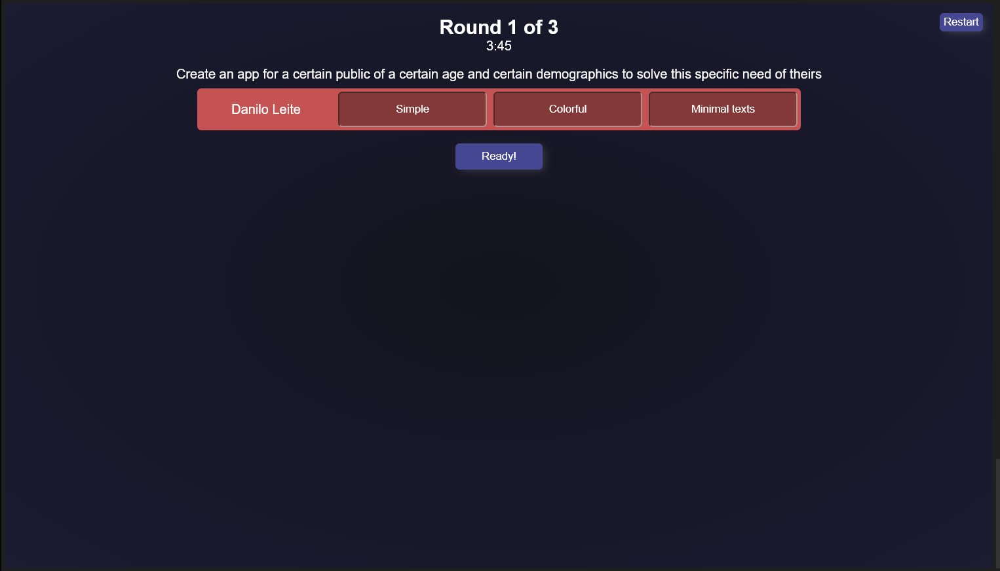

# D BrainWrite Tool for Microsoft Teams

Brainwriting is a very interesting method to hold group brainstorms! It is useful in many situations where a group of people might need to come up with fresh ideas about a fresh topic. Use **design thinking** brainwriting method to brainstorm ideas in group! 

### Setup
First, you will set up:


- How many rounds you will go through
- How many terms/keywords each participant is to add per round
- And a reference time limit for each round. 

You will also talk to each other and define a goal for the session. Set it in the theme text area during setup for reference during your meeting! It is recommended to define a scope that's strict enough to be focused but also generic enough to allow freedom of thought! Each participant might start at very different places and brainwriting will help you all contribute to each other's ideas.

### Rounds



In the first round, each participant in the meeting will start a 'board' by writing a number of terms they think up relating to the goal of the brainwriting session. 


When everyone is finished with that, each board goes to the next participant and a new round is started. For each round, each participant will add a number of terms to the board they receive. They must add keywords and thoughts that **contribute to the ideas that are already present in that board.** Normally, you will have as many rounds as participants, so everyone starts board and everyone else gets a chance to further elaborate on each other's ideas.


## How to use?

This is is not yet published to the Microsoft Teams store.

To use it you will need to be have access to a developer enabled Teams tenant (you can create one for free and read Microsoft's docs on how to set up). After that, do the following steps: 

You will need npm and node.js.

```bash
git clone https://github.com/DDanDev/d-brainwrite-tool-for-teams.git
npm install
npm run dev

# Tunnel your localhost to a publicly available address, for example using ngrok free:
ngrok http 5173
```

After that, edit TeamsAppPackage/manifest.json so that configurationURL points to your tunneled host. Zip the JSON and both PNGs in that same folder and upload it as a custom app to a meeting using while logged in to your dev enabled Teams user account.

## Tech

Deps: React + TypeScript + Vite + LiveShareSDK + TeamsJS + SASS

DevDeps: Prettier + ESLint + ngrok

*Other small deps + other Microsoft Teams dependencies and requirements*

# License

Do not use this without explicit consent by me, please. This might become a product (for free use) and I will update License info here.
